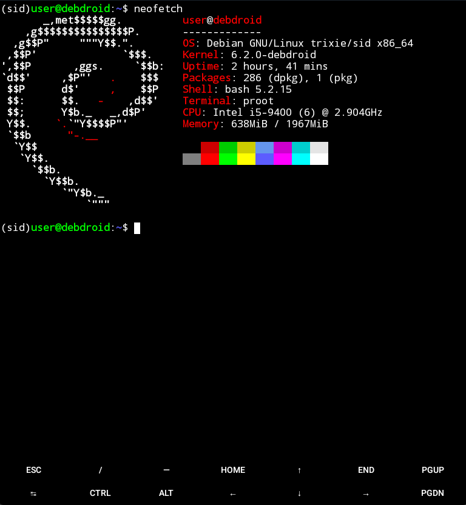

# DebDroid (debdroid-ng)
DebDroid - Debian for Android OS! \
[](https://www.gnu.org/software/bash/) [](https://code.visualstudio.com/)



# What is DebDroid?
DebDroid is an Debian Installer for the Android OS, this method of installing Debian on Android does not require root access and you can run your favorite Linux Applications Easily

> There's innovation in Linux. There are some really good technical features that I'm proud of. There are capabilities in Linux that aren't in other operating systems \
	-- Linus Torvalds

# About DebDroid,
DebDroid will install Debian Container within termux, creates a fresh debian prefix for the location of the container, usually it will be placed in: \
`/data/data/com.termux/files/debian`

It lives outside the `$PREFIX` directory so if you decide to erase your broken `$PREFIX` directory, then your debian container will remain intact, and is portable,

This script also self-updating so you can update it anytime by downloading it, this checks updates every time you open fresh Debian Container,

# Installation
You can install DebDroid by entering:
```
curl --location https://git.io/Jt68D > debdroid
mv debdroid $PREFIX/bin
chmod +x $PREFIX/bin/debdroid
```

You can install Debian in just a few keystrokes by doing:
```
debdroid install
```
This will install Debian Buster, If you want to install other than Debian Buster, you can specify a suite by doing
```
debdroid install sid
```
or
```
debdroid install oldstable
```

A list of supported releases can be listed by typing `debdroid install list`

During Installation, it will update and upgrade the Debian System if necessary and installs required packages \
it will prompt you to enter your required information, this is necessary to capture user input, otherwise it will fallback to the following default credentials:
* User: `user`
* Password: `passw0rd`


In case you interrupted your installation, you can do `debdroid.sh reconfigure` or `debdroid.sh configure` although this can be used to refresh Debian Container or to update it

# Starting Debian
You can start Debian by typing:
```
debdroid launch
```
Or to enter root shell:
```
debdroid launch-asroot
```

If you want to enter debian other than shell, you can pass commands by doing:
```
debdroid launch [command]
```

## Customizing your Debian Container
You can customize your debian container needs with the command `debianize`, it allows you to install desired packages and desktop environments you need

If you want to install xfce, you can type `debianize xfce4-desktop` although if you want minimal one, you may use `debianize xfce4-core` and you can start the desktop environment with `startxfce4` command, it will ask you for your resolution if running it first time

You can list of other tasks with `debianize list` command

If you want to install chromium easily, you can do `debianize chromium` and you can run `chromium` command or launching it via desktop menu without needing to specify `--no-sandbox`


Although you will get problems when using it on `armhf` although it may work with some effort

## Setting up User Accounts
You can add users with the command `addusers` so you can create user account and add the user to sudoers access, syntax is:
```
sudo addusers <user>
```

You can set the default user account by echoing the value of your user
```
echo <username> > /var/debdroid/userinfo.rc
```
and restart to switch to new user account, although you may use `adduser` or `useradd` if you want

## Initializing Sounds
You can initialize sounds and transmit it via Termux's Pulseaudio, to enable sounds you may open xsdl app and keep it running, no need to configure `PULSE_SERVER` inside the guest

Although if you want to do it in Termux Way, you need to enter this commands in termux
```
~ $ pulseaudio --start --exit-idle-time=-1
~ $ pacmd load-module module-native-protocol-tcp auth-ip-acl=127.0.0.1 auth-anonymous=1
```
If possible, you need to restart the container

## Running Termux Commands inside Debian
It's also possible to run host commands in the guest, and this can be used to run programs which are not available to the debian repositories, this implementation is like from the feature of [WSL](https://docs.microsoft.com/en-us/windows/wsl/interop)


In some cases this may conflict with some dependencies or programs that is optimized for the usage with Termux and may cause some problems like compiling programs and having different libc linker, due to the way on [how they're set up between them](https://wiki.termux.com/wiki/Differences_from_Linux), or may impose security risks, if you don't want to happen, you can disable it by typing:
```
echo 0 > /var/debdroid/binfmt/corrosive-session
```
And restart your shell,

To Enable it back, type:
```
echo 1 > /var/debdroid/binfmt/corrosive-session
```

# Deleting Debian Container
If you don't want to use debian anymore, you can do
```
debdroid purge
```

Keep in mind that if you do `termux-reset` then your debian container will not be deleted, although the next time you do that will do a dependency install if possible

# Updating Debian Containers
Sometimes, an update can be useful like newer bugfixes, to do that, a simple `debdroid reconfigure` will do the trick, but this also refreshes your Debian System

# Feature Requests and Bug Reports
You can bug reports by creating an [issue](https://github.com/WMCB-Tech/debdroid-ng/issues)

# Reference Links
* [PRoot](https://proot-me.github.io/)
* [Termux](https://termux.com)
* [Debian Wiki](https://wiki.debian.org)
